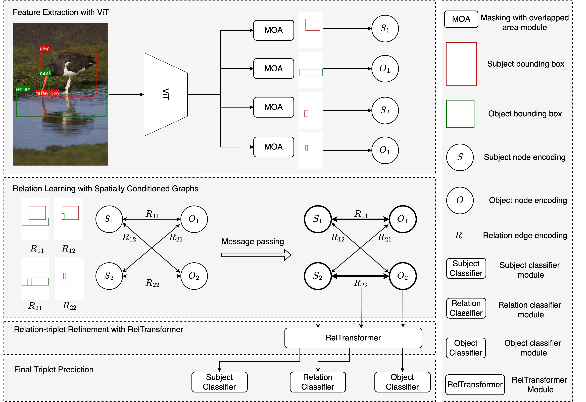

# Vision Transformer based Spatially Conditioned Graphs for Long Tail Visual Relationship Recognition


## Our Architecture




## Installation

```
pip install -r requirements.txt
pip install ./CLIP

git clone https://github.com/fredzzhang/pocket.git
pip install -e pocket
```

## Datasets

### GQA
Create a folder for all images:
```
# ROOT=path/to/cloned/repository
cd $ROOT/data/gvqa
mkdir images
```
Download the dataset [here](https://drive.google.com/file/d/1ypmMOq2TkZyLNVuU9agHS7_QcsfTtBmn/view?usp=sharing) and our annotations [here](https://drive.google.com/drive/folders/1ksiXGRB7QYjElXqhO_kpkWqcV4F4NQ4X?usp=sharing). Unzip it under the data folder. You should see a `gvqa` folder unzipped there. It contains a seed folder called `seed0` that contains .json annotations that suit the dataloader used in this repo. 

### Visual Genome
Create a folder for all images:
```
# ROOT=path/to/cloned/repository
cd $ROOT/data/vg8k
mkdir VG_100K
```
Download the dataset [here](https://drive.google.com/file/d/1S8WNnK0zt8SDAGntkCiRDfJ8rZOR3Pgx/view?usp=sharing) and our annotations [here](https://drive.google.com/drive/folders/1wHL0BXa89ExYE4SA5LEQ8e3y0kVPzdkU?usp=sharing). Unzip it under the data folder. You should see a `vg8k` folder unzipped there. It contains a seed folder called `seed3` that contains .json annotations that suit the dataloader used in this repo. Unzip all images (part 1 and part 2) into `VG_100K/`. There should be a total of 108249 files.

## Pretrained Weights

### GVQA
| Backbone  |      SCG      | RelTransformer         | url                                              |
| --------- | :------------:| :---------------------:| -------------------------------------------------|
| ResNet-50 | &check;       | &cross;              | model\|logs\|csv                                 |
| ResNet-50 | &check;       | &check;              | model\|logs\|csv                                 |
| ViT-B/16  | &check;       | &cross;              | model\|logs\|csv                                 |
| ViT-B/16  | &check;       | &check;              | [model](https://drive.google.com/file/d/1KxTTwcfalqehFmfjCPQps1cyVdZIEjPf/view?usp=sharing)\|[logs](https://drive.google.com/file/d/1u005ESmiFrGdY_0V3_OPpZFBI9qg91O_/view?usp=sharing)\|[csv](https://drive.google.com/file/d/1LfYRQbB78qmPgHlVli3dx60UzGpA2cAn/view?usp=sharing) |

### VG8K
| Backbone  |     SCG       | RelTransformer   | url                                                          |
| --------- | :------------:| :---------------:| ------------------------------------------------------------ |
| ResNet-50 | &check;       | &cross;          | model\|logs\|csv                                             |
| ResNet-50 | &check;       | &check;          | model\|logs\|csv                                             |
| ViT-B/16  | &check;       | &cross;          | model\|logs\|csv                                             |
| ViT-B/16  | &check;       | &check;          | [model](https://drive.google.com/file/d/13dWBnID0AR1mG7XWZcaSjalWUplCL-hK/view?usp=sharing)\|[logs](https://drive.google.com/file/d/1V1G7OPjSv8roh7qeM7pUcQfDSU28ujBr/view?usp=sharing)\|[csv](https://drive.google.com/file/d/1Az_ozAypYFBIo4SMp5tKZ_CPugyHZMot/view?usp=sharing) |


### GVQA
Train our relationship network using a resnet50 backbone, run
```
python -m torch.distributed.launch \
        --nproc_per_node=8 \
        --use_env main.py \
        --backbone_name resnet50 \
        --dataset gvqa \
        --batch_size 4 \
        --output_dir exps/rn50_gvqa_SCG_WCE
```
Train our relationship network using a ViT-B/16 backbone, run

```
python -m torch.distributed.launch \
        --nproc_per_node=8 \
        --use_env main.py \
        --backbone_name CLIP_ViT_16 \
        --dataset gvqa \
        --batch_size 2 \
        --output_dir exps/vit16_gvqa_SCG_WCE
```
Train our relationship network using a resnet50 backbone and RelTransformer, run
```
python -m torch.distributed.launch \
        --nproc_per_node=8 \
        --use_env main.py \
        --backbone_name resnet50 \
        --dataset gvqa \
        --batch_size 4 \
        --rel-head \
        --output_dir exps/rn50_gvqa_SCG_WCE_RelTrans
```
Train our relationship network using a ViT-B/16 backbone and RelTransformer, run

```
python -m torch.distributed.launch \
        --nproc_per_node=8 \
        --use_env main.py \
        --backbone_name CLIP_ViT_16 \
        --dataset gvqa \
        --batch_size 2 \
        --rel-head \
        --output_dir exps/vit16_gvqa_SCG_WCE_RelTrans
```


### VG8K
Train our relationship network using a resnet50 backbone, run
```
python -m torch.distributed.launch \
        --nproc_per_node=8 \
        --use_env main.py \
        --backbone_name resnet50 \
        --dataset vg8k \
        --batch_size 4 \
        --output_dir exps/rn50_vg8k_SCG_WCE
```
Train our relationship network using a ViT-B/16 backbone, run

```
python -m torch.distributed.launch \
        --nproc_per_node=8 \
        --use_env main.py \
        --backbone_name CLIP_ViT_16 \
        --dataset vg8k \
        --batch_size 2 \
        --output_dir exps/vit16_vg8k_SCG_WCE
```
Train our relationship network using a resnet50 backbone and RelTransformer, run
```
python -m torch.distributed.launch \
        --nproc_per_node=8 \
        --use_env main.py \
        --backbone_name resnet50 \
        --dataset vg8k \
        --batch_size 4 \
        --rel-head \
        --output_dir exps/rn50_vg8k_SCG_WCE_RelTrans
```
Train our relationship network using a ViT-B/16 backbone and RelTransformer, run

```
python -m torch.distributed.launch \
        --nproc_per_node=8 \
        --use_env main.py \
        --backbone_name CLIP_ViT_16 \
        --dataset vg8k \
        --batch_size 2 \
        --rel-head \
        --output_dir exps/vit16_vg8k_SCG_WCE_RelTrans
```


## To test the trained networks, run

### GVQA
```
python -m torch.distributed.launch \
        --nproc_per_node=1 \
        --use_env test.py \
        --dataset gvqa \
        --output_dir test \
        --backbone_name CLIP_ViT_16 \
        --rel-head \
        --seperate-classifier \
        --batch_size 1 \
        --resume exps/vit16_gvqa_SCG_WCE/checkpoint0003.pth
```

### VG8K
```
python -m torch.distributed.launch \
        --nproc_per_node=1 \
        --use_env test.py \
        --dataset vg8k \
        --output_dir test \
        --backbone_name CLIP_ViT_16 \
        --rel-head \
        --seperate-classifier \
        --batch_size 1 \
        --resume exps/vit16_vg8k_SCG_WCE/checkpoint0006.pth
```

## Citing VTSCG_LTVRR
If you find VTSCG_LTVRR useful in your research, please consider citing:
```bibtex
@article{xxxxx,
  title={Vision Transformer-based Spatially Conditioned Graphs for Long Tail Visual Relationship Recognition CVPR 2023 LTVRR Challenge},
  author={Chenyu Wang, Shuo Wang, Shenghua Gao},
  journal={arXiv preprint arXiv},
  year={2023}
}
```
